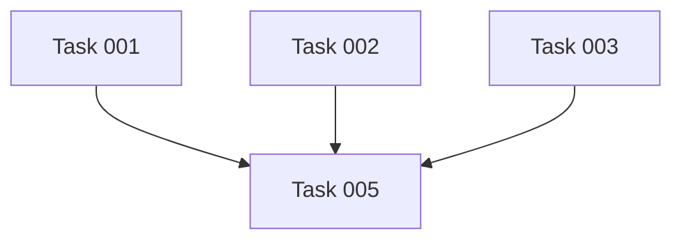

# Best Practices: Filesystem Task Implementation

Best Practices für die Implementierung von Filesystem-basierten Tasks.

## Branch-Naming

### Schema

**Standard**: `task-NNN-short-description`

**Beispiele**:
```
✅ task-001-ui-toggle-component
✅ task-042-integration-test-suite
✅ task-123-api-rate-limiting

❌ Task-001-UI-Toggle
❌ task-1-ui
❌ feature/task-001
```

### Regeln

1. **Lowercase**: Immer kleingeschrieben
2. **Kebab-case**: Wörter mit Bindestrichen trennen
3. **Task-ID prefix**: Beginnt mit `task-NNN`
4. **Kurze Beschreibung**: Max. 3-4 Wörter nach Task-ID
5. **Keine Emojis**: Nur ASCII-Zeichen

### Slug-Generierung

**Aus Task-Dateinamen**:
```bash
file="task-001-ui-toggle-component.md"
branch_name="${file%.md}"
# → task-001-ui-toggle-component
```

**Aus Task-Titel**:
```bash
title="UI Toggle Component"
slug=$(echo "$title" | \
  tr '[:upper:]' '[:lower:]' | \
  tr ' ' '-' | \
  sed 's/[^a-z0-9-]//g')
branch_name="task-001-$slug"
# → task-001-ui-toggle-component
```

### Branch-Lifecycle

```
develop (main)
  ↓ checkout -b
task-001-ui-toggle-component
  ↓ commits
  ↓ push -u origin
task-001-ui-toggle-component (remote)
  ↓ PR created
  ↓ Review & Merge
develop (main)
  ↓ delete branch
```

## Commit-Messages

### Format

**Standard**: Emoji Conventional Commits

```
<emoji> <type>: <description>

[optional body]
```

### Commit-Typen aus Task-Labels

| Task-Label | Commit-Typ | Emoji |
|------------|------------|-------|
| `bug`, `fix` | fix | 🐛 |
| `feature`, `enhancement` | feat | ✨ |
| `docs`, `documentation` | docs | 📚 |
| `refactor` | refactor | ♻️ |
| `performance` | perf | ⚡ |
| `test` | test | 🧪 |
| `style` | style | 💎 |
| `chore` | chore | 🔧 |

**Beispiele**:
```bash
# Task mit Label "feature"
git commit -m "✨ feat: Add ThemeToggle component"

# Task mit Label "bug"
git commit -m "🐛 fix: Correct theme persistence bug"

# Task mit Label "test"
git commit -m "🧪 test: Add ThemeToggle unit tests"
```

### Spezielle Commit-Messages

**Task-Status-Updates**:
```bash
# Start Task
git commit -m "🔄 chore: Start task-001 implementation"

# Complete Task
git commit -m "✅ chore: Mark task-001 as completed"

# Block Task
git commit -m "🚫 chore: Block task-001 (waiting for API spec)"
```

**Task-Implementierung**:
```bash
# Haupt-Commit (am Ende)
git commit -m "✨ feat(task-001): Implement UI toggle component

- Add ThemeToggle component
- Implement localStorage persistence
- Add unit tests
- Integrate in Layout

Closes task-001"
```

### Atomic Commits

**Best Practice**: Ein Commit pro logischer Änderung

```bash
# Gut ✅
git commit -m "✨ feat: Add ThemeToggle component"
git commit -m "🧪 test: Add ThemeToggle tests"
git commit -m "📚 docs: Document ThemeToggle usage"

# Schlecht ❌
git commit -m "Implement everything"
```

**Alternative**: Squash beim PR (empfohlen für Filesystem-Tasks)

```bash
# Während Entwicklung: Viele kleine Commits
git commit -m "WIP: Add component"
git commit -m "WIP: Add tests"
git commit -m "WIP: Fix linting"

# Vor Merge: Squash zu einem aussagekräftigen Commit
git rebase -i HEAD~3
# → Squash zu "✨ feat(task-001): Implement UI toggle component"
```

## PR-Gestaltung

### PR-Titel

**Format**: `task-NNN: <Short Description>`

**Beispiele**:
```
✅ task-001: UI Toggle Component
✅ task-042: Integration Test Suite
✅ task-123: API Rate Limiting

❌ Implement UI Toggle
❌ Task 1
❌ [task-001] UI Toggle Component
```

### PR-Body-Template

```markdown
## Task: task-NNN - <Task-Titel>

**Plan**: <feature-name>
**Task-Datei**: `.plans/<feature-name>/tasks/task-NNN-*.md`

**Beschreibung**:
<Task-Beschreibung aus Task-Datei>

**Änderungen**:
- <Änderung 1>
- <Änderung 2>
- <Änderung 3>

**Test-Plan**:
<Akzeptanzkriterien aus Task-Datei als Checkboxen>
- [x] Kriterium 1
- [x] Kriterium 2
- [x] Kriterium 3

**Story Points**: <Estimate>
**Priority**: <Priority>
**Labels**: <Labels>

**Status**: in_progress → completed

---

**Closes**: task-NNN
```

### PR-Labels

**Automatisches Mapping** aus Task-Labels:

| Task-Label | PR-Label |
|------------|----------|
| `bug`, `fix` | `bug` |
| `feature`, `enhancement` | `enhancement` |
| `docs`, `documentation` | `documentation` |
| `refactor` | `refactor` |
| `performance` | `performance` |
| `test` | `test` |
| `ui` | `ui` |
| `api` | `api` |

**Beispiel**:
```bash
# Task-Labels: [feature, ui, react]
# → PR-Labels: enhancement, ui, react

gh pr create \
  --title "task-001: UI Toggle Component" \
  --body "$(cat pr-body.md)" \
  --label "enhancement,ui,react" \
  --base develop
```

### PR-Größe

**Ideal**: 150-400 Zeilen (Lines of Code)

**Guidelines**:
- ✅ **< 150 LOC**: Sehr gut, schnelles Review
- ✅ **150-400 LOC**: Gut, normales Review
- ⚠️ **400-800 LOC**: OK, aber langsames Review
- ❌ **> 800 LOC**: Zu groß, aufteilen!

**Zu große PRs aufteilen**:
```bash
# Beispiel: Task-001 ist zu groß (1200 LOC)

# → Aufteilung in Sub-Tasks:
task-001a: Core Component (300 LOC)
task-001b: Styling & Animations (250 LOC)
task-001c: Tests (350 LOC)
task-001d: Documentation (100 LOC)
```

## Task-Auswahl

### Prioritäts-Strategie

**Reihenfolge**:
1. **Must-Have** (MVP) zuerst
2. **Should-Have** wenn MVP fast fertig
3. **Could-Have** nur wenn genug Zeit

**Beispiel**:
```
Plan: dark-mode-toggle

Must-Have (4 Tasks):
✅ task-001: UI Toggle Component
🚧 task-002: Theme State Management
📋 task-003: CSS Variables
📋 task-004: Persistence

Should-Have (2 Tasks):
📋 task-005: Integration Tests
📋 task-006: Accessibility

Could-Have (2 Tasks):
📋 task-007: Animations
📋 task-008: System Preference
```

**Strategie**:
1. Starte mit task-001 (Must-Have, niedrigste ID)
2. Dann task-002 (Must-Have, nächste ID)
3. Etc.

### Dependency-Awareness

**Vor Task-Start**: Dependencies prüfen!

**Beispiel**:
```markdown
# Task-005: Integration Tests

## Dependencies
- **Requires**: task-001, task-002, task-003
- **Blocks**: task-006

→ Task-005 kann NICHT gestartet werden, bevor task-001, task-002, task-003 completed sind!
```

**Dependency-Graph nutzen** (in STATUS.md):


**Strategie**:
1. Prüfe Dependencies-Graph
2. Wähle Tasks ohne Required-Dependencies
3. Oder wähle Tasks mit completed Required-Dependencies

## Code-Qualität

### Vor PR-Erstellung

**Checkliste**:
- [ ] Alle Akzeptanzkriterien erfüllt?
- [ ] Tests geschrieben und grün?
- [ ] Linting erfolgreich? (ESLint, Ruff, Checkstyle)
- [ ] Build erfolgreich?
- [ ] Keine Debug-Code oder console.log?
- [ ] Dokumentation aktualisiert?

**Tools nutzen**:
```bash
# Java
mvn clean verify

# Python
ruff check .
ruff format .
pytest

# JavaScript/TypeScript
npm run lint
npm run type-check
npm test
npm run build
```

### Code-Review-Readiness

**Guter Code**:
- ✅ Lesbar und selbsterklärend
- ✅ Gute Namensgebung (Variablen, Funktionen)
- ✅ Kommentare für komplexe Logik
- ✅ Error Handling implementiert
- ✅ Tests decken Edge Cases ab

**Schlechter Code**:
- ❌ Unlesbarer Code
- ❌ Magic Numbers ohne Kontext
- ❌ Keine Error Handling
- ❌ Keine Tests

### Self-Review

**Vor PR-Erstellung**: Eigene Änderungen reviewen!

```bash
# Diff anschauen
git diff develop...HEAD

# Oder mit GUI-Tool
git difftool develop...HEAD
```

**Fragen**:
- Würde ich diesen Code mergen?
- Ist der Code verständlich ohne Kontext?
- Fehlen Tests für Edge Cases?
- Gibt es bessere Lösungen?

## Task-Organisation

### Task-Status-Workflow

**Best Practice**: Max. 1-2 Tasks gleichzeitig `in_progress`

**Workflow**:
```
1. Task auswählen (pending)
2. Status → in_progress
3. Implementieren
4. PR erstellen
5. Status → completed
6. Nächsten Task auswählen
```

**Vermeiden**:
```
❌ Mehrere Tasks parallel starten
❌ Tasks halbfertig liegen lassen
❌ Direkt zum nächsten Task ohne PR
```

### Blocker-Management

**Falls Task geblockt wird**:
1. Status auf `blocked` setzen
2. Grund dokumentieren:
   ```markdown
   ## Notes
   **Blocked**: Waiting for API specification from backend team (ETA: 2024-11-20)
   ```
3. Anderen Task wählen
4. Blocker auflösen → Status zurück auf `pending`

### Task-Splitting

**Falls Task zu groß** (> 8 Story Points):

**Option 1**: Sub-Tasks erstellen
```
task-001: UI Toggle Component (Original, 13 SP)

→ Aufteilen:
task-001a: Core Component (5 SP)
task-001b: Styling (3 SP)
task-001c: Tests (5 SP)
```

**Option 2**: Task-Beschreibung präzisieren
```
Original: "Implement complete authentication system" (21 SP)

→ Präzisieren:
task-001: Login Form UI (3 SP)
task-002: Login API Endpoint (5 SP)
task-003: JWT Token Generation (3 SP)
task-004: Session Management (5 SP)
```

## Integration mit /commit und /create-pr

### Automatische Integration

**`/develop:implement-fs-task` nutzt intern**:
1. `/commit` für Commits während Implementierung
2. `/create-pr` für PR-Erstellung am Ende

**Vorteil**: Konsistente Workflows, keine doppelte Logik

### Manuelle Alternative

**Falls separater Workflow gewünscht**:

```bash
# 1. Task implementieren (ohne /develop:implement-fs-task)
cd my-project
git checkout -b task-001-ui-toggle

# 2. Code-Änderungen durchführen
# ... (Implementierung) ...

# 3. Committen mit /commit
/commit

# 4. PR erstellen mit /create-pr
/create-pr

# 5. Task-Status manuell aktualisieren
# Edit task-001-ui-toggle-component.md: status: completed
```

**Empfehlung**: `/develop:implement-fs-task` nutzen für Automatisierung!

## Best Practices Summary

### DO ✅

1. **Branch-Naming**: Lowercase, kebab-case, `task-NNN-description`
2. **Commits**: Atomic, Emoji Conventional Commits
3. **PR-Titel**: `task-NNN: Short Description`
4. **PR-Body**: Template mit Task-Link, Beschreibung, Test-Plan
5. **Dependencies**: Vor Task-Start prüfen
6. **Code-Qualität**: Linting, Tests, Build vor PR
7. **Status-Updates**: Sofort committen, STATUS.md regenerieren
8. **Task-Fokus**: Max. 1-2 Tasks gleichzeitig `in_progress`

### DON'T ❌

1. **Keine unlesbaren Branch-Namen**: `feature/task-001` oder `Task-1`
2. **Keine vagen Commits**: `WIP` oder `Fix stuff`
3. **Keine großen PRs**: > 800 LOC aufteilen!
4. **Keine fehlenden Tests**: Immer Tests schreiben
5. **Keine veralteten Status**: STATUS.md aktuell halten
6. **Keine parallelen Tasks**: Fokus auf einen Task
7. **Keine übersprungenen Dependencies**: Immer Dependencies prüfen

## Beispiel-Workflow (Best Practice)

```bash
# 1. Task auswählen
/develop:implement-fs-task

# Claude:
# Pending Tasks:
# 1. task-001: UI Toggle Component (3 SP)
# 2. task-002: Theme State Management (5 SP)
# Auswahl: 1

# 2. Dependencies prüfen
# Claude: ✅ No dependencies

# 3. Branch erstellen
# Claude: ✅ Branch: task-001-ui-toggle-component

# 4. Task-Status Update
# Claude: ✅ Status: pending → in_progress

# 5. Implementierung
# Claude: Implementiert Code basierend auf Akzeptanzkriterien

# 6. Tests
# Claude: Schreibt Unit Tests (3/3 Kriterien erfüllt)

# 7. Pre-Commit-Checks
# Claude: Linting, Tests, Build ✅

# 8. PR erstellen
# Claude: PR #456 erstellt

# 9. Finalisierung
# Claude: Status: in_progress → completed
# Claude: STATUS.md aktualisiert

# 10. Nächsten Task
/develop:implement-fs-task
```

## Siehe auch

- [workflow.md](./workflow.md) - Detaillierter Workflow
- [task-management.md](./task-management.md) - Task-Status-Management
- [troubleshooting.md](./troubleshooting.md) - Problemlösungen
- [../commit/best-practices.md](../commit/best-practices.md) - Commit Best Practices
- [../create-pr/best-practices.md](../create-pr/best-practices.md) - PR Best Practices
