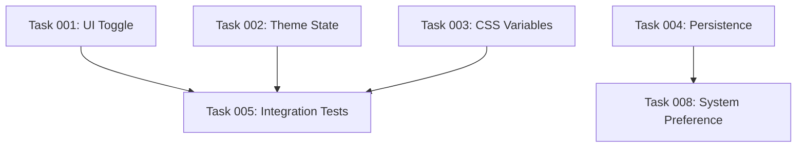

# Task Management: Status-Updates und STATUS.md Regenerierung

Detaillierte Anleitung zum Management von Task-Status und automatischer STATUS.md-Aktualisierung.

## Task-Status-Lifecycle

```
pending
  ↓
in_progress
  ↓          ↓
completed  blocked
             ↓
          pending (nach Blocker-Auflösung)
```

## Task-Status-Definitionen

### pending
- **Bedeutung**: Task ist bereit zur Bearbeitung
- **Voraussetzungen**: Alle Dependencies erfüllt
- **Nächster Schritt**: Kann gestartet werden

### in_progress
- **Bedeutung**: Task wird aktiv bearbeitet
- **Voraussetzungen**: Branch erstellt, Code-Änderungen laufen
- **Nächster Schritt**: Code fertigstellen, Tests schreiben

### completed
- **Bedeutung**: Task ist fertig und merged
- **Voraussetzungen**: PR merged, alle Akzeptanzkriterien erfüllt
- **Nächster Schritt**: Keine weitere Aktion nötig

### blocked
- **Bedeutung**: Task kann nicht fortgesetzt werden
- **Voraussetzungen**: Externe Abhängigkeit oder Problem
- **Nächster Schritt**: Blocker auflösen, dann zu `pending` zurück

## Status-Update in Task-Datei

### Format

Jede Task-Datei hat eine Metadata-Sektion:

```markdown
## Metadata
- **ID**: task-NNN
- **Status**: <status>
- **Priority**: <priority>
- **Estimate**: <story-points> Story Points
- **Labels**: [<label1>, <label2>, ...]
- **Assignee**: <name>
- **Created**: YYYY-MM-DD
- **Updated**: YYYY-MM-DD
```

### Status ändern

**Mit Edit-Tool**:

```python
# Beispiel: pending → in_progress
old_string = "- **Status**: pending"
new_string = "- **Status**: in_progress"
edit_file(task_file, old_string, new_string)

# Updated-Datum aktualisieren
from datetime import date
today = date.today().isoformat()

old_date_line = grep("**Updated**:", task_file)  # z.B. "- **Updated**: 2024-11-15"
new_date_line = f"- **Updated**: {today}"
edit_file(task_file, old_date_line, new_date_line)
```

**Mit sed (Bash)**:

```bash
# Status ändern
sed -i 's/- \*\*Status\*\*: pending/- **Status**: in_progress/' task-001-*.md

# Updated-Datum aktualisieren
today=$(date +%Y-%m-%d)
sed -i "s/- \*\*Updated\*\*: .*/- **Updated**: $today/" task-001-*.md
```

### Git-Commit für Status-Update

**Empfehlung**: Separater Commit für Status-Änderungen

```bash
# Status: pending → in_progress
git add .plans/dark-mode-toggle/tasks/task-001-*.md
git commit -m "🔄 chore: Start task-001 implementation"

# Status: in_progress → completed
git add .plans/dark-mode-toggle/tasks/task-001-*.md
git commit -m "✅ chore: Mark task-001 as completed"

# Status: in_progress → blocked
git add .plans/dark-mode-toggle/tasks/task-001-*.md
git commit -m "🚫 chore: Block task-001 (waiting for API spec)"
```

## STATUS.md Struktur

### Vollständiges Beispiel

```markdown
# Project Status: Dark Mode Toggle

**Last Updated**: 2024-11-18 14:32

## Progress Overview

- **Total Tasks**: 8
- **Completed**: 1 (12.5%)
- **In Progress**: 2 (25%)
- **Pending**: 4 (50%)
- **Blocked**: 1 (12.5%)

## Tasks by Priority

### Must-Have (MVP)
- [x] task-001: UI Toggle Component (3 SP) - completed
- [ ] task-002: Theme State Management (5 SP) - in_progress
- [ ] task-003: CSS Variables Setup (2 SP) - pending
- [ ] task-004: Local Storage Persistence (2 SP) - pending

### Should-Have
- [ ] task-005: Integration Tests (3 SP) - blocked
- [ ] task-006: Accessibility Support (2 SP) - pending

### Could-Have
- [ ] task-007: Animation Transitions (2 SP) - pending
- [ ] task-008: System Preference Detection (3 SP) - in_progress

## Tasks by Status

### Completed ✅
- task-001: UI Toggle Component (3 SP)

### In Progress 🚧
- task-002: Theme State Management (5 SP)
- task-008: System Preference Detection (3 SP)

### Pending 📋
- task-003: CSS Variables Setup (2 SP)
- task-004: Local Storage Persistence (2 SP)
- task-006: Accessibility Support (2 SP)
- task-007: Animation Transitions (2 SP)

### Blocked 🚫
- task-005: Integration Tests (3 SP)
  - **Reason**: Waiting for task-002 and task-003 to complete

## Dependencies Graph


```

## STATUS.md Regenerierung

### Wann regenerieren?

**Trigger-Events**:
1. Task-Status ändert sich (pending → in_progress → completed)
2. Neue Tasks hinzugefügt
3. Tasks gelöscht oder zusammengeführt
4. Dependencies geändert

### Regenerierungs-Algorithmus

**Input**: Alle Task-Dateien in `.plans/[feature]/tasks/`

**Output**: Aktualisierte `STATUS.md`

**Schritte**:

```python
def regenerate_status_md(plan_dir):
    # 1. Alle Task-Dateien einlesen
    task_files = glob(f"{plan_dir}/tasks/task-*.md")
    tasks = []

    for file in task_files:
        task = parse_task_file(file)
        tasks.append(task)

    # 2. Progress-Statistiken berechnen
    total = len(tasks)
    completed = sum(1 for t in tasks if t["status"] == "completed")
    in_progress = sum(1 for t in tasks if t["status"] == "in_progress")
    pending = sum(1 for t in tasks if t["status"] == "pending")
    blocked = sum(1 for t in tasks if t["status"] == "blocked")

    completed_pct = (completed / total * 100) if total > 0 else 0

    # 3. Tasks nach Priority gruppieren
    tasks_by_priority = {
        "must": [t for t in tasks if t["priority"] == "must"],
        "should": [t for t in tasks if t["priority"] == "should"],
        "could": [t for t in tasks if t["priority"] == "could"],
        "wont": [t for t in tasks if t["priority"] == "wont"],
    }

    # 4. Tasks nach Status gruppieren
    tasks_by_status = {
        "completed": [t for t in tasks if t["status"] == "completed"],
        "in_progress": [t for t in tasks if t["status"] == "in_progress"],
        "pending": [t for t in tasks if t["status"] == "pending"],
        "blocked": [t for t in tasks if t["status"] == "blocked"],
    }

    # 5. STATUS.md generieren
    status_md = generate_status_template(
        plan_name=get_plan_name(plan_dir),
        total=total,
        completed=completed,
        in_progress=in_progress,
        pending=pending,
        blocked=blocked,
        completed_pct=completed_pct,
        tasks_by_priority=tasks_by_priority,
        tasks_by_status=tasks_by_status,
        tasks=tasks  # Für Dependencies-Graph
    )

    # 6. STATUS.md schreiben
    write_file(f"{plan_dir}/STATUS.md", status_md)

    return status_md
```

### Task-Parsing

```python
def parse_task_file(file_path):
    """Parse Task-Datei und extrahiere Metadata."""
    content = read_file(file_path)

    # Regex-basiertes Parsing
    task = {
        "id": extract_pattern(content, r'\*\*ID\*\*: (task-\d+)'),
        "title": extract_pattern(content, r'^# Task-\d+: (.+)$'),
        "status": extract_pattern(content, r'\*\*Status\*\*: (\w+)'),
        "priority": extract_pattern(content, r'\*\*Priority\*\*: (\w+)'),
        "estimate": int(extract_pattern(content, r'\*\*Estimate\*\*: (\d+)')),
        "labels": parse_labels(content),
        "assignee": extract_pattern(content, r'\*\*Assignee\*\*: (.+)'),
        "created": extract_pattern(content, r'\*\*Created\*\*: ([\d-]+)'),
        "updated": extract_pattern(content, r'\*\*Updated\*\*: ([\d-]+)'),
        "description": extract_description(content),
        "acceptance_criteria": extract_checkboxes(content, "Acceptance Criteria"),
        "dependencies": parse_dependencies(content),
    }

    return task
```

### Template-Generierung

```python
def generate_status_template(
    plan_name,
    total,
    completed,
    in_progress,
    pending,
    blocked,
    completed_pct,
    tasks_by_priority,
    tasks_by_status,
    tasks
):
    """Generiere STATUS.md Template."""
    from datetime import datetime

    now = datetime.now().strftime("%Y-%m-%d %H:%M")

    # Header
    md = f"# Project Status: {plan_name}\n\n"
    md += f"**Last Updated**: {now}\n\n"

    # Progress Overview
    md += "## Progress Overview\n\n"
    md += f"- **Total Tasks**: {total}\n"
    md += f"- **Completed**: {completed} ({completed_pct:.1f}%)\n"
    md += f"- **In Progress**: {in_progress} ({in_progress/total*100:.1f}%)\n"
    md += f"- **Pending**: {pending} ({pending/total*100:.1f}%)\n"
    md += f"- **Blocked**: {blocked} ({blocked/total*100:.1f}%)\n\n"

    # Tasks by Priority
    md += "## Tasks by Priority\n\n"

    priority_labels = {
        "must": "Must-Have (MVP)",
        "should": "Should-Have",
        "could": "Could-Have",
        "wont": "Won't-Have (Future)"
    }

    for priority, label in priority_labels.items():
        tasks_list = tasks_by_priority.get(priority, [])
        if not tasks_list:
            continue

        md += f"### {label}\n"
        for task in tasks_list:
            checkbox = "[x]" if task["status"] == "completed" else "[ ]"
            md += f"- {checkbox} {task['id']}: {task['title']} ({task['estimate']} SP) - {task['status']}\n"
        md += "\n"

    # Tasks by Status
    md += "## Tasks by Status\n\n"

    status_sections = [
        ("completed", "Completed ✅"),
        ("in_progress", "In Progress 🚧"),
        ("pending", "Pending 📋"),
        ("blocked", "Blocked 🚫"),
    ]

    for status, label in status_sections:
        tasks_list = tasks_by_status.get(status, [])
        md += f"### {label}\n"

        if not tasks_list:
            md += "[None]\n\n"
            continue

        for task in tasks_list:
            md += f"- {task['id']}: {task['title']} ({task['estimate']} SP)\n"

            # Bei blocked: Reason anzeigen
            if status == "blocked" and "block_reason" in task:
                md += f"  - **Reason**: {task['block_reason']}\n"

        md += "\n"

    # Dependencies Graph
    md += "## Dependencies Graph\n\n"
    md += "```mermaid\n"
    md += generate_mermaid_graph(tasks)
    md += "```\n"

    return md
```

### Mermaid-Graph generieren

```python
def generate_mermaid_graph(tasks):
    """Generiere Mermaid-Dependency-Graph."""
    graph = "graph TD\n"

    for task in tasks:
        task_id = task["id"]
        task_title = task["title"]

        # Node definieren
        node_id = task_id.replace("-", "")
        graph += f"    {node_id}[{task_id}: {task_title}]\n"

        # Dependencies
        requires = task["dependencies"].get("requires", [])
        for dep_id in requires:
            dep_node_id = dep_id.replace("-", "")
            graph += f"    {dep_node_id} --> {node_id}\n"

    return graph
```

## Automatisierung

### Vollständige Regenerierung

```bash
#!/bin/bash
# regenerate-status.sh

PLAN_DIR="$1"

if [ ! -d "$PLAN_DIR" ]; then
  echo "Error: Plan directory not found: $PLAN_DIR"
  exit 1
fi

# Python-Script aufrufen
python3 << 'EOF'
import sys
import glob
import re
from datetime import datetime

def regenerate_status(plan_dir):
    # ... (siehe oben) ...
    pass

plan_dir = sys.argv[1]
regenerate_status(plan_dir)
EOF

echo "✅ STATUS.md regenerated: $PLAN_DIR/STATUS.md"
```

**Verwendung**:
```bash
./regenerate-status.sh .plans/dark-mode-toggle
```

### Integration in Workflow

**Nach Task-Status-Update**:
```bash
# 1. Task-Status ändern
edit_task_status task-001 "in_progress"

# 2. STATUS.md regenerieren
regenerate_status_md .plans/dark-mode-toggle

# 3. Committen
git add .plans/dark-mode-toggle/tasks/task-001-*.md
git add .plans/dark-mode-toggle/STATUS.md
git commit -m "🔄 chore: Start task-001 implementation"
```

## Best Practices

### DO ✅

1. **Status-Update sofort committen**:
   - Separater Commit für Status-Änderung
   - Nicht mit Code-Änderungen mischen

2. **STATUS.md immer aktuell halten**:
   - Nach jedem Status-Update regenerieren
   - Automatisierung nutzen

3. **Klare Commit-Messages**:
   - `🔄 chore: Start task-NNN`
   - `✅ chore: Mark task-NNN as completed`
   - `🚫 chore: Block task-NNN (reason)`

4. **Dependencies dokumentieren**:
   - Required-Tasks explizit angeben
   - Block-Reasons bei blocked-Status

### DON'T ❌

1. **Keine manuellen STATUS.md-Edits**:
   - Immer regenerieren, nicht manuell anpassen
   - Konsistenz sicherstellen

2. **Nicht mehrere Status-Updates batchen**:
   - Ein Commit pro Status-Änderung
   - Klare Historie

3. **Keine veralteten Status-Dateien**:
   - STATUS.md muss immer aktuell sein
   - Bei Inkonsistenzen: Sofort regenerieren

## Troubleshooting

### STATUS.md zeigt falsche Zahlen

**Problem**: Progress-Zahlen stimmen nicht mit Tasks überein

**Lösung**:
```bash
# STATUS.md neu generieren
regenerate_status_md .plans/dark-mode-toggle

# Verifizieren
grep "Total Tasks:" .plans/dark-mode-toggle/STATUS.md
# → - **Total Tasks**: 8

# Mit manueller Zählung vergleichen
ls .plans/dark-mode-toggle/tasks/*.md | wc -l
# → 8
```

### Task-Status-Update schlägt fehl

**Problem**: Edit-Command findet String nicht

**Ursache**: Status-Format in Task-Datei abweicht

**Lösung**:
```bash
# Aktuelles Format prüfen
grep "Status" task-001-*.md

# Falls Format abweicht: Manuell korrigieren
# Dann Edit-Command erneut ausführen
```

### Dependencies-Graph fehlt

**Problem**: Mermaid-Graph wird nicht generiert

**Ursache**: Keine Dependencies in Tasks definiert

**Lösung**:
```bash
# Dependencies in Task-Dateien definieren
## Dependencies
- **Requires**: task-001, task-002
- **Blocks**: task-005

# STATUS.md regenerieren
regenerate_status_md .plans/dark-mode-toggle
```

## Siehe auch

- [workflow.md](./workflow.md) - Vollständiger Implementierungs-Workflow
- [best-practices.md](./best-practices.md) - Best Practices
- [troubleshooting.md](./troubleshooting.md) - Problemlösungen
