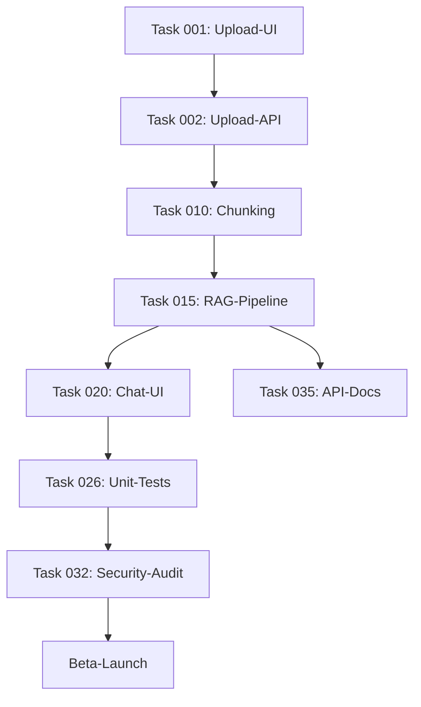

# Project Status: RAG-basiertes Dokumenten-Analyse-System

**Last Updated**: 2025-11-18

## Progress Overview

- **Total Tasks**: 8 (Initial MVP-Tasks)
- **Completed**: 0 (0%)
- **In Progress**: 0 (0%)
- **Pending**: 8 (100%)
- **Blocked**: 0 (0%)

## Tasks by Priority

### Must-Have (MVP)

- [ ] **task-001**: Upload-UI-Komponente mit Drag-and-Drop (3 SP) - pending
- [ ] **task-002**: Upload-API-Endpoint (5 SP) - pending
- [ ] **task-010**: Chunking-Strategie implementieren (5 SP) - pending
- [ ] **task-015**: RAG-Query-Pipeline implementieren (8 SP) - pending
- [ ] **task-020**: Chat-UI-Komponente (5 SP) - pending
- [ ] **task-026**: Unit-Tests Backend (5 SP) - pending
- [ ] **task-032**: Security-Audit (OWASP Top 10) (3 SP) - pending

### Should-Have (Post-MVP)

- [ ] **task-035**: API-Dokumentation (Swagger/OpenAPI) (2 SP) - pending

## Tasks by Status

### Completed ✅

None yet - bereit für Start!

### In Progress 🚧

None yet.

### Pending 📋

#### Epic 1: Dokumenten-Upload & UI
- **task-001-upload-ui-komponente.md** (3 SP) [frontend-developer]
  - React Drag-and-Drop Upload
  - Format & Größen-Validierung
  - Progress-Indikator

#### Epic 2: Backend-APIs
- **task-002-upload-api-endpoint.md** (5 SP) [java-developer]
  - POST /api/documents Endpoint
  - S3/MinIO-Integration
  - Async-Processing-Queue

#### Epic 3: AI/ML-Pipeline
- **task-010-chunking-strategie.md** (5 SP) [ai-engineer]
  - Text-Chunking (500-1000 Tokens)
  - Overlap-Strategie
  - Metadata-Tracking

- **task-015-rag-query-pipeline.md** (8 SP) [ai-engineer]
  - Semantic Search
  - LLM-Integration (GPT-4/Claude)
  - Quellenangaben-Generierung

#### Epic 4: Frontend-UI
- **task-020-chat-ui-komponente.md** (5 SP) [frontend-developer]
  - Chat-Interface
  - Message-Liste mit Sources
  - Loading & Error-States

#### Epic 5: Testing & Quality
- **task-026-unit-tests-backend.md** (5 SP) [java-developer]
  - Unit-Tests (> 80% Coverage)
  - Integration-Tests
  - CI-Integration

- **task-032-security-audit.md** (3 SP) [code-reviewer]
  - OWASP-Top-10-Check
  - Penetration-Testing
  - GDPR-Compliance

#### Epic 6: Documentation
- **task-035-api-dokumentation.md** (2 SP) [markdown-syntax-formatter]
  - Swagger/OpenAPI-Docs
  - README-Quick-Start
  - API-Examples

### Blocked 🚫

None currently.

## Story Points Summary

- **Total SP**: 36
- **Must-Have SP**: 34 (94%)
- **Should-Have SP**: 2 (6%)

**Estimated Duration**: ~6 Wochen mit Team von ~7 FTE (gemäß PRD)

## Dependencies Graph



## Critical Path

```
Upload-UI → Upload-API → Chunking → RAG-Pipeline → Chat-UI → Testing → Security-Audit → Launch
```

**Blockers**: task-032 (Security-Audit) muss vor Beta-Launch abgeschlossen sein (Zero-Critical-Vulnerabilities-Requirement).

## Additional Tasks Required

**Noch nicht erstellt (aus PRD identifiziert)**:
- [ ] task-007: PDF Text-Extraktion (PyPDF2/pdfplumber)
- [ ] task-008: DOCX Text-Extraktion (python-docx)
- [ ] task-011: Embedding-Generation (OpenAI API-Integration)
- [ ] task-012: Vector-DB-Setup (ChromaDB)
- [ ] task-013: Async Processing-Queue (Celery + RabbitMQ)
- [ ] task-005: Dokumenten-Übersicht-UI (Liste, Status, Delete)
- [ ] task-018: Query-API-Endpoint (POST /api/query)
- [ ] task-025: End-to-End-Integration
- [ ] task-027: Integration-Tests
- [ ] task-033: CI/CD-Pipeline-Setup
- [ ] task-034: Monitoring & Logging (Sentry/Datadog)
- [ ] task-037: Beta-Launch-Vorbereitung
- [ ] task-038: Code-Review

**Total-Estimate**: ~60-80 Story Points für vollständiges MVP

## Next Steps

### Immediate (Woche 0-1)
1. Tech-Stack-Entscheidung finalisieren (Vector-DB, LLM-Provider)
2. UI/UX-Designs reviewen und approven
3. Dev-Environment-Setup (Repo, CI/CD, Dependencies)
4. Start mit task-001 (Upload-UI) & task-002 (Upload-API) parallel

### Short-Term (Woche 2-4)
1. Backend-APIs implementieren (Upload, Text-Extraction, Vektorisierung)
2. RAG-Pipeline entwickeln und testen
3. Benchmark-Testset erstellen (50 Frage/Antwort-Paare)

### Mid-Term (Woche 4-6)
1. Frontend-Integration (Upload + Chat-UI)
2. End-to-End-Testing
3. Security-Audit durchführen
4. Beta-Launch vorbereiten

## Risks & Mitigation

**High-Priority-Risks**:
1. **LLM-API-Kosten**: Monitoring einrichten, Prompt-Optimierung, Caching
2. **Antwort-Qualität**: Chunking-Strategy-Testing, Prompt-Engineering, Human-Feedback
3. **Vector-DB-Performance**: Load-Testing vor Launch, Cloud-Migration-Plan bereit

## Success Metrics (Tracking)

Basierend auf PRD-Ziele:
- [ ] Query-Latenz P95 < 5 Sekunden
- [ ] Processing-Zeit < 30 Sekunden für 10-Seiten-PDF
- [ ] Upload-Success-Rate > 95%
- [ ] Unit-Test-Coverage > 80%
- [ ] Zero-Critical-Security-Vulnerabilities

## Team-Assignments

| Agent/Role | Primary Tasks | Workload |
|------------|---------------|----------|
| **frontend-developer** | task-001, task-020 | ~8 SP |
| **java-developer** | task-002, task-026 | ~10 SP |
| **ai-engineer** | task-010, task-015 | ~13 SP |
| **code-reviewer** | task-032 | ~3 SP |
| **markdown-syntax-formatter** | task-035 | ~2 SP |

**Note**: Java-Developer-Agent wird für Python-Backend eingesetzt aufgrund von Enterprise-Backend-Expertise (übertragbare Patterns).

## Related Documents

- **EPIC.md**: Feature-Übersicht, Business-Value, Success-Metrics
- **PRD.md**: Vollständiges Product-Requirements-Document (../../PRD.md)
- **Task-Details**: Siehe `/tasks/*.md` für detaillierte Acceptance-Criteria

---

**Ready to start!** 🚀

Nächster Schritt: Team-Review und Task-001 / Task-002 parallel starten.
