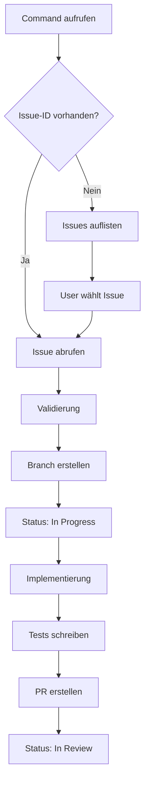

# Workflow Guide

Detaillierte Beschreibung des `/develop:implement-linear-task` Workflows mit Beispielen und Best Practices.

## Workflow-Übersicht



## Phase 1: Issue-Identifikation

### Mit Issue-ID Argument

**Command**:

```bash
/develop:implement-linear-task PROJ-123
```

**Ablauf**:

1. Issue-ID validieren (Format: `[A-Z]+-[0-9]+`)
2. Issue via MCP abrufen
3. Validierung durchführen

**Validierungs-Checks**:

- ✅ Issue existiert
- ✅ Issue ist dem User zugewiesen
- ✅ Issue ist nicht bereits "Done"
- ✅ Issue hat validen Status

**Beispiel-Output**:

```text
✅ Issue PROJ-123 gefunden
📋 Titel: User Authentication System
👤 Assignee: Daniel
🏷️  Labels: feature, backend, high-priority
📊 Status: Backlog
```

### Ohne Argument (Interaktiv)

**Command**:

```bash
/develop:implement-linear-task
```

**Ablauf**:

1. Zugewiesene Issues via MCP abrufen
2. Issues filtern (nur nicht-Done)
3. Sortiert anzeigen (Priorität → Erstellungsdatum)
4. User-Auswahl

**Beispiel-Output**:

```text
📋 Ihre zugewiesenen Issues:

1. PROJ-123 - User Authentication System
   Status: Backlog | Priority: High | Labels: feature, backend

2. PROJ-124 - Dark Mode Toggle
   Status: Backlog | Priority: Medium | Labels: feature, frontend

3. PROJ-125 - API Rate Limiting
   Status: In Progress | Priority: High | Labels: enhancement, backend

Welches Issue möchten Sie umsetzen? [1-3]:
```

**Sortierung**:

1. **Status** - "In Progress" zuerst
2. **Priority** - High → Medium → Low
3. **Created** - Neueste zuerst

### Issue-Validierung

**Checks vor Workflow-Start**:

```javascript
// Pseudocode für Validierung
const validateIssue = (issue) => {
  // 1. Assignee Check
  if (issue.assignee?.id !== currentUser.id) {
    return {
      valid: false,
      error: "Issue ist nicht Ihnen zugewiesen",
      suggestion: "Bitte weisen Sie sich das Issue zu oder wählen Sie ein anderes"
    }
  }

  // 2. Status Check
  if (issue.state.name === "Done" || issue.state.name === "Canceled") {
    return {
      valid: false,
      error: `Issue ist bereits ${issue.state.name}`,
      suggestion: "Wählen Sie ein offenes Issue"
    }
  }

  // 3. Description Check
  if (!issue.description || issue.description.trim() === "") {
    return {
      valid: false,
      warning: "Issue hat keine Beschreibung",
      suggestion: "Möchten Sie trotzdem fortfahren? [y/N]"
    }
  }

  return { valid: true }
}
```

## Phase 2: Branch-Erstellung

### Branch-Naming

**Schema**: `feature/<issue-id>-<issue-title-slug>`

**Slug-Generierung**:

```javascript
const generateBranchName = (issue) => {
  const slug = issue.title
    .toLowerCase()
    .replace(/[^a-z0-9\s-]/g, '') // Sonderzeichen entfernen
    .replace(/\s+/g, '-')         // Leerzeichen → Bindestriche
    .replace(/-+/g, '-')          // Mehrfache Bindestriche → einzeln
    .slice(0, 50)                 // Max. 50 Zeichen

  return `feature/${issue.identifier.toLowerCase()}-${slug}`
}
```

**Beispiele**:

| Issue Title | Branch Name |
|-------------|-------------|
| User Authentication System | `feature/proj-123-user-authentication-system` |
| Fix: API Rate Limiting Bug | `feature/proj-124-fix-api-rate-limiting-bug` |
| Add Dark Mode (Frontend) | `feature/proj-125-add-dark-mode-frontend` |

### Pre-Branch-Checks

**Vor Branch-Erstellung prüfen**:

```bash
# 1. Working Directory sauber?
git status

# Erwartetes Ergebnis:
# "nothing to commit, working tree clean"

# Falls uncommitted changes:
# → Warnung anzeigen
# → Option: Stash, Commit, oder Abbruch

# 2. Auf main/develop Branch?
current_branch=$(git branch --show-current)

# Falls nicht:
# → Frage: "Auf main/develop wechseln? [Y/n]"

# 3. Remote up-to-date?
git fetch origin
git status

# Falls behind:
# → "main ist X commits behind. Pull durchführen? [Y/n]"
```

### Branch erstellen

**Commands**:

```bash
# Ensure we're on main/develop
git checkout main  # oder develop

# Pull latest changes
git pull origin main

# Create and checkout new branch
git checkout -b feature/proj-123-user-authentication-system
```

**Bestätigung**:

```text
✅ Branch erstellt: feature/proj-123-user-authentication-system
📍 Aktueller Branch: feature/proj-123-user-authentication-system
🔄 Basiert auf: main (commit abc1234)
```

### Branch existiert bereits

**Szenario**: Branch `feature/proj-123-...` existiert bereits

**Optionen**:

1. **Wechseln** - Auf existierenden Branch wechseln
2. **Überschreiben** - Branch löschen und neu erstellen
3. **Suffix** - Neuen Branch mit `-v2` Suffix erstellen
4. **Abbruch** - Workflow abbrechen

**Beispiel-Interaktion**:

```text
⚠️  Branch feature/proj-123-user-authentication-system existiert bereits

Was möchten Sie tun?
1. Auf existierenden Branch wechseln
2. Branch überschreiben (ACHTUNG: Änderungen gehen verloren!)
3. Neuen Branch mit Suffix erstellen (feature/proj-123-user-authentication-system-v2)
4. Abbrechen

Auswahl [1-4]:
```

## Phase 3: Issue-Status Update

### Workflow-States abrufen

**Via MCP**:

```javascript
// Team-Workflow-States abrufen
const states = await linear_get_workflow_states({
  teamId: issue.team.id
})

// Beispiel-Rückgabe:
[
  { id: "state_backlog", name: "Backlog", type: "backlog" },
  { id: "state_todo", name: "Todo", type: "unstarted" },
  { id: "state_progress", name: "In Progress", type: "started" },
  { id: "state_review", name: "In Review", type: "started" },
  { id: "state_done", name: "Done", type: "completed" }
]
```

### Status zu "In Progress" setzen

**Ziel-State ermitteln**:

```javascript
// "In Progress" State finden
const inProgressState = states.find(s =>
  s.type === "started" && s.name.toLowerCase().includes("progress")
)

// Fallback: Ersten "started" State nehmen
const targetState = inProgressState || states.find(s => s.type === "started")
```

**Status-Update durchführen**:

```javascript
const result = await linear_update_issue_state({
  issueId: issue.id,
  stateId: targetState.id
})

if (result.success) {
  console.log(`✅ Issue-Status: ${issue.state.name} → ${targetState.name}`)
}
```

### Linear Comment erstellen

**Optional**: Automatischen Comment hinzufügen:

```javascript
await linear_create_comment({
  issueId: issue.id,
  body: `🚀 Implementation gestartet in Branch: \`${branchName}\`\n\n` +
        `Workflow initiiert via Claude Code \`/develop:implement-linear-task\``
})
```

**Comment-Beispiel in Linear**:

```markdown
🚀 Implementation gestartet in Branch: `feature/proj-123-user-authentication-system`

Workflow initiiert via Claude Code `/develop:implement-linear-task`
```

## Phase 4: Implementierung

### Issue-Analyse

**Issue-Daten extrahieren**:

```javascript
const analysisData = {
  // Titel & Beschreibung
  title: issue.title,
  description: issue.description,

  // Labels → Commit-Typ
  labels: issue.labels.nodes.map(l => l.name),
  commitType: deriveCommitType(issue.labels.nodes),

  // Akzeptanzkriterien
  acceptanceCriteria: extractAcceptanceCriteria(issue.description),

  // Affected Files (aus Description)
  affectedFiles: extractAffectedFiles(issue.description),

  // Priority
  priority: issue.priority
}
```

### Commit-Typ ableiten

**Labels → Emoji Mapping**:

```javascript
const deriveCommitType = (labels) => {
  const labelNames = labels.map(l => l.name.toLowerCase())

  // Priorität: bug > feature > refactor > docs
  if (labelNames.some(l => ['bug', 'fix', 'bugfix'].includes(l))) {
    return { emoji: '🐛', type: 'fix' }
  }
  if (labelNames.some(l => ['feature', 'enhancement'].includes(l))) {
    return { emoji: '✨', type: 'feat' }
  }
  if (labelNames.some(l => ['refactor', 'refactoring'].includes(l))) {
    return { emoji: '♻️', type: 'refactor' }
  }
  if (labelNames.some(l => ['docs', 'documentation'].includes(l))) {
    return { emoji: '📚', type: 'docs' }
  }
  if (labelNames.some(l => ['test', 'testing'].includes(l))) {
    return { emoji: '🧪', type: 'test' }
  }
  if (labelNames.some(l => ['performance', 'perf'].includes(l))) {
    return { emoji: '⚡', type: 'perf' }
  }

  // Default: feature
  return { emoji: '✨', type: 'feat' }
}
```

### Akzeptanzkriterien extrahieren

**Aus Description parsen**:

```javascript
const extractAcceptanceCriteria = (description) => {
  // Suche nach Patterns:
  // - "Acceptance Criteria:"
  // - "AC:"
  // - Checkboxen (- [ ])

  const patterns = [
    /## Acceptance Criteria[:\s]+([\s\S]*?)(?=##|$)/i,
    /## AC[:\s]+([\s\S]*?)(?=##|$)/i,
    /- \[ \]\s+(.+)/g
  ]

  for (const pattern of patterns) {
    const match = description.match(pattern)
    if (match) {
      // Extrahiere Kriterien als Array
      return extractListItems(match[0])
    }
  }

  return []
}
```

**Beispiel-Description**:

```markdown
## User Story
As a user, I want to authenticate via OAuth2...

## Acceptance Criteria
- [ ] User can log in with Google
- [ ] User can log in with GitHub
- [ ] Session is persisted for 30 days
- [ ] User can log out

## Technical Notes
Use Passport.js for OAuth2 integration
```

**Extrahierte Criteria**:

```javascript
[
  "User can log in with Google",
  "User can log in with GitHub",
  "Session is persisted for 30 days",
  "User can log out"
]
```

### Code-Implementierung

**Strategie**:

1. Betroffene Dateien identifizieren
2. Änderungen durchführen (via Edit/Write Tools)
3. Code-Review durchführen
4. Tests schreiben

**Beispiel-Workflow**:

```text
📝 Implementierung startet...

1. Analyzing issue requirements...
   ✅ 4 acceptance criteria identified
   ✅ Commit type: ✨ feat

2. Identifying affected files...
   📁 src/auth/oauth2.ts
   📁 src/routes/auth.ts
   📁 src/config/passport.ts

3. Implementing changes...
   ✅ OAuth2 strategy configured
   ✅ Routes updated
   ✅ Session handling added

4. Writing tests...
   ✅ OAuth2 integration tests
   ✅ Session persistence tests

✅ Implementation complete!
```

## Phase 5: Tests schreiben

### Test-Plan aus Akzeptanzkriterien

**Akzeptanzkriterien → Tests**:

```javascript
// Akzeptanzkriterium:
"User can log in with Google"

// → Test:
describe('OAuth2 Authentication', () => {
  it('should allow user to log in with Google', async () => {
    // Test implementation
  })
})
```

**Test-Typen**:

- **Unit Tests** - Einzelne Funktionen
- **Integration Tests** - OAuth2-Flow
- **E2E Tests** - Kompletter Login-Flow

### Test-Coverage

**Mindest-Coverage**:

- ✅ Neue Funktionen: 80%+
- ✅ Geänderte Funktionen: 70%+
- ✅ Edge Cases: abgedeckt

**Tests ausführen**:

```bash
# Unit Tests
npm test

# Coverage Report
npm run test:coverage

# E2E Tests
npm run test:e2e
```

## Phase 6: PR-Erstellung

### Integration mit `/create-pr`

**Automatisch `/create-pr` aufrufen**:

```bash
# Nach Implementierung:
/create-pr
```

**Oder manuell**:

```bash
# Commits erstellen
git add .
git commit -m "✨ feat: User authentication via OAuth2 (PROJ-123)"

# Push to remote
git push origin feature/proj-123-user-authentication-system

# PR erstellen via gh CLI
gh pr create --title "feat: User Authentication via OAuth2 (PROJ-123)" \
  --body "$(cat pr-template.md)"
```

### PR-Template mit Linear-Integration

**Template**:

```markdown
## Linear Issue
[PROJ-123: User Authentication System](https://linear.app/team/issue/PROJ-123)

## Beschreibung
Implementierung eines OAuth2-basierten Authentifizierungssystems mit Google und GitHub Login.

## Änderungen
- ✨ OAuth2-Strategy mit Passport.js konfiguriert
- 🔒 Session-Handling für 30-Tage-Persistenz
- 🧪 Integration- und E2E-Tests hinzugefügt
- 📚 Dokumentation aktualisiert

## Test-Plan
Basierend auf Linear Issue Akzeptanzkriterien:

- [x] User kann sich mit Google einloggen
- [x] User kann sich mit GitHub einloggen
- [x] Session wird für 30 Tage persistiert
- [x] User kann sich ausloggen

## Additional Tests
- [x] Unit Tests (Coverage: 85%)
- [x] Integration Tests (OAuth2-Flow)
- [x] E2E Tests (Login → Dashboard)

## Breaking Changes
Keine

## Linear Status Update
- Before: **Backlog**
- After: **In Review**

---
*Auto-generated via `/develop:implement-linear-task`*
```

### PR-Labels aus Issue-Labels

**Mapping**:

```javascript
const derivePrLabels = (issueLabels) => {
  const mapping = {
    'bug': 'bug',
    'feature': 'enhancement',
    'enhancement': 'enhancement',
    'docs': 'documentation',
    'refactor': 'refactoring',
    'performance': 'performance',
    'security': 'security'
  }

  return issueLabels
    .map(l => mapping[l.name.toLowerCase()])
    .filter(Boolean)
}
```

**Beispiel**:

- Issue-Labels: `feature`, `backend`, `high-priority`
- PR-Labels: `enhancement`, `backend`

### PR nach Linear verlinken

**Linear Comment mit PR-Link**:

```javascript
await linear_create_comment({
  issueId: issue.id,
  body: `🔀 Pull Request erstellt: [#123](https://github.com/org/repo/pull/123)\n\n` +
        `Ready for review!`
})
```

### Issue-Status zu "In Review"

**Nach PR-Erstellung**:

```javascript
const reviewState = states.find(s =>
  s.name.toLowerCase().includes('review')
)

if (reviewState) {
  await linear_update_issue_state({
    issueId: issue.id,
    stateId: reviewState.id
  })

  console.log('✅ Issue-Status: In Progress → In Review')
}
```

## Vollständiges Workflow-Beispiel

### Szenario: Feature-Implementierung

**Ausgangslage**:

- Issue: `PROJ-123 - User Authentication System`
- Status: Backlog
- Labels: feature, backend, high-priority
- Assignee: Daniel

**Command**:

```bash
/develop:implement-linear-task PROJ-123
```

**Workflow-Ausführung**:

```text
1️⃣ Issue-Identifikation
✅ Issue PROJ-123 gefunden
📋 Titel: User Authentication System
🏷️  Labels: feature, backend, high-priority
👤 Assignee: Daniel
📊 Status: Backlog

2️⃣ Branch-Erstellung
✅ Branch erstellt: feature/proj-123-user-authentication-system
📍 Basiert auf: main (commit abc1234)

3️⃣ Issue-Status Update
✅ Issue-Status: Backlog → In Progress
💬 Comment in Linear erstellt

4️⃣ Implementierung
📝 4 Akzeptanzkriterien identifiziert
🔍 Betroffene Dateien:
   - src/auth/oauth2.ts
   - src/routes/auth.ts
   - src/config/passport.ts

✨ Änderungen durchgeführt:
   ✅ OAuth2-Strategy konfiguriert
   ✅ Routes erstellt
   ✅ Session-Handling implementiert

5️⃣ Tests schreiben
🧪 Tests erstellt:
   ✅ Unit Tests (15 tests, 85% coverage)
   ✅ Integration Tests (5 tests)
   ✅ E2E Tests (3 tests)

6️⃣ PR-Erstellung
✅ Commits erstellt
✅ Branch gepusht
✅ PR #123 erstellt: "feat: User Authentication via OAuth2 (PROJ-123)"
✅ Issue-Status: In Progress → In Review
💬 PR-Link in Linear gepostet

✅ Workflow abgeschlossen!
📊 Summary:
   - Issue: PROJ-123
   - Branch: feature/proj-123-user-authentication-system
   - PR: #123
   - Status: In Review
```

## Best Practices

### Do's ✅

- **Issue-Beschreibung lesen** - Alle Details verstehen
- **Akzeptanzkriterien prüfen** - Als Test-Plan nutzen
- **Atomic Commits** - Logische Änderungen einzeln committen
- **Tests schreiben** - Vor PR-Erstellung
- **Linear aktualisieren** - Status und Comments

### Don'ts ❌

- **Fremde Issues bearbeiten** - Nur zugewiesene Issues
- **Status manuell ändern** - Workflow automatisch laufen lassen
- **Ohne Tests pushen** - Immer Tests schreiben
- **Große PRs** - Features aufteilen wenn möglich
- **Linear ignorieren** - Immer Status synchron halten

## Siehe auch

- **[linear-integration.md](./linear-integration.md)** - MCP Server Setup
- **[best-practices.md](./best-practices.md)** - Best Practices für Issue-Implementation
- **[troubleshooting.md](./troubleshooting.md)** - Häufige Probleme und Lösungen
