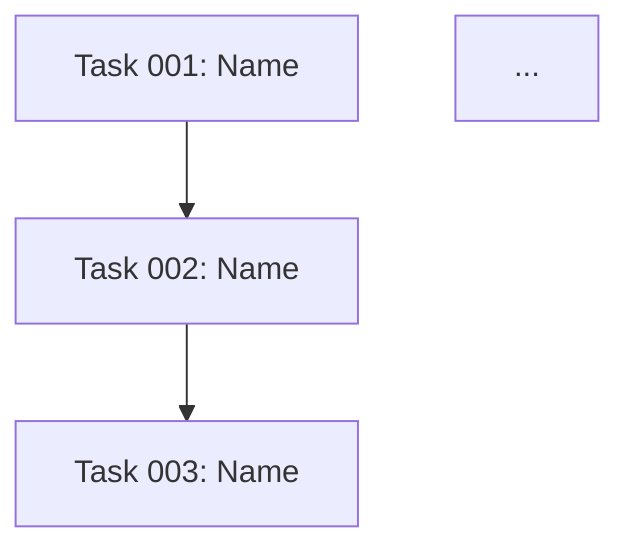

# Claude Command: Create Filesystem Plan

Erstelle einen strukturierten Projektplan aus einem PRD-Dokument und speichere ihn als Filesystem-basierte Struktur im `.plans/` Verzeichnis.

## Rolle & Expertise

Du agierst als **Scrum Master, Product Owner und Entwicklungsleiter** mit folgender Expertise:

- **Akademischer Hintergrund**: MSc in Computer Science
- **Best Practices**: Aktuelle Standards von renommierten Universitäten und Fachhochschulen
- **Agile Methoden**: Scrum, Kanban, User Story Mapping
- **Task-Breakdown**: Atomic, testbare und schätzbare Tasks

## Verwendung

```bash
# Standard: PRD.md im aktuellen Verzeichnis
/project:create-plan-fs

# Spezifisches PRD-Dokument
/project:create-plan-fs --prd docs/requirements/feature-x.md
/project:create-plan-fs PRDs/01-rag-system.md

# Interaktiver Modus
/project:create-plan-fs --interactive
```

## Workflow

### 1. PRD-Dokument einlesen

- **Standard**: `PRD.md` im aktuellen Verzeichnis
- **Custom**: Über `--prd <Pfad>` oder als Argument angegeben
- **Fallback**: Interaktive Nachfrage falls nicht gefunden

**Validierung**:
- PRD-Struktur vollständig?
- Ziele & Erfolgsmetriken definiert?
- Anforderungen priorisiert (MoSCoW)?

### 2. Feature-Namen ableiten

Aus dem PRD einen Feature-Namen in `kebab-case` generieren:

**Beispiele**:
- "Dark Mode Toggle" → `dark-mode-toggle`
- "RAG-basiertes Dokumenten-Analyse-System" → `rag-dokumenten-analyse-system`
- "User Authentication Flow" → `user-authentication-flow`

**Ziel-Verzeichnis**:
```
.plans/[feature-name]/
```

**Duplikat-Check**:
- Prüfe ob `.plans/[feature-name]/` bereits existiert
- Interaktive Bestätigung bei Duplikaten
- Optionen: Überschreiben, anderen Namen wählen, abbrechen

### 3. Task-Breakdown durchführen

Leite aus dem PRD **in sich abgeschlossene Tasks** ab:

**Kriterien für gute Tasks**:
- ✅ **Atomic**: Eine logische Einheit
- ✅ **Actionable**: Sofort umsetzbar
- ✅ **Testable**: Akzeptanzkriterien definiert
- ✅ **Assignable**: Für einen Entwickler/Agenten
- ✅ **Estimated**: Geschätzter Aufwand (Story Points)

**Task-Struktur** (siehe Abschnitt "Task-Datei-Template" unten):
```markdown
# Task-NNN: [Konkrete Beschreibung]

## Metadata
- **ID**: task-NNN
- **Status**: pending
- **Priority**: must/should/could/wont
- **Estimate**: [Story Points]
- **Labels**: [Tags]
- **Assignee**: [Agent/Role]
- **Created**: [Datum]
- **Updated**: [Datum]

## Description
[Detaillierte Anforderungen & User Story]

## Acceptance Criteria
- [ ] Kriterium 1
- [ ] Kriterium 2
...

## Dependencies
- **Requires**: task-XXX (optional)
- **Blocks**: task-YYY (optional)

## Agent Recommendation
**Recommended Agent**: `agent-name`
**Rationale**: [Warum dieser Agent]

## Implementation Notes
[Technische Details, API-Integration, etc.]

## Testing Strategy
[Unit-Tests, Integration-Tests, etc.]

## Notes
[PRD-Referenzen, Challenges, Future Enhancements]
```

### 4. Dateien erstellen

**Verzeichnisstruktur**:
```
.plans/[feature-name]/
├── EPIC.md          # Feature-Übersicht
├── STATUS.md        # Progress-Tracking
└── tasks/
    ├── task-001-[slug].md
    ├── task-002-[slug].md
    └── ...
```

#### 4.1 EPIC.md erstellen

Enthält:
- Status & Metadata
- Executive Summary (aus PRD)
- Business Value
- Success Metrics
- Timeline & Milestones
- Dependencies (External/Internal)
- Key Risks
- MVP Scope (Must/Should/Won't-Have)
- Link zum PRD

**Template**: Siehe Abschnitt "EPIC.md Template" unten

#### 4.2 STATUS.md erstellen

Enthält:
- Progress Overview (Total/Completed/In Progress/Pending/Blocked)
- Tasks by Priority (Must/Should/Could)
- Tasks by Status (Completed/In Progress/Pending/Blocked)
- Story Points Summary
- Dependencies Graph (Mermaid)
- Critical Path
- Additional Tasks Required (falls identifiziert)
- Next Steps (Immediate/Short-Term/Mid-Term)
- Risks & Mitigation
- Success Metrics Tracking
- Team Assignments (Agent-basiert)

**Template**: Siehe Abschnitt "STATUS.md Template" unten

#### 4.3 Task-Dateien erstellen

Jeder Task wird als `task-NNN-[slug].md` gespeichert:

**Naming Convention**:
- `task-001-upload-ui-komponente.md`
- `task-002-upload-api-endpoint.md`
- `task-010-chunking-strategie.md` (Lücken sind OK für spätere Einfügungen)

**Template**: Siehe Abschnitt "Task-Datei-Template" unten

### 5. Konsistenz-Check

**Vor dem Speichern**:
- [ ] Keine Duplikate oder Redundanzen
- [ ] Konsistentes Gesamtbild der Anwendung
- [ ] Tasks sind vollständig und umsetzbar
- [ ] Dependencies korrekt verknüpft
- [ ] Priorisierung logisch
- [ ] Story Points realistisch
- [ ] Agent-Empfehlungen passend
- [ ] EPIC.md, STATUS.md und Task-Dateien konsistent

## Agent-Empfehlungen

Basierend auf Task-Typ werden KI-Agenten empfohlen:

| Task-Typ | Empfohlene Agenten | Verwendung |
|----------|-------------------|------------|
| **Code Review** | `code-reviewer` | Qualitätssicherung |
| **Java Development** | `java-developer` | Spring Boot, Enterprise Java |
| **Python Development** | `python-expert` | Django, FastAPI, Data Science |
| **Frontend (React/Next.js)** | `frontend-developer` | UI-Komponenten, SSR/SSG |
| **AI/ML Features** | `ai-engineer` | LLM-Integration, ML-Pipelines |
| **Agent Development** | `agent-expert` | KI-Agenten-Entwicklung |
| **Documentation** | `markdown-syntax-formatter` | Docs, READMEs |

**Details**: [create-plan/agent-mapping.md](create-plan/agent-mapping.md)

## Qualitätskriterien

### Tasks müssen erfüllen:

- [ ] **Präzise Formulierung**: Entwickler können ohne Nachfragen umsetzen
- [ ] **Klare Akzeptanzkriterien**: Testbar und messbar
- [ ] **Dependencies dokumentiert**: Reihenfolge klar
- [ ] **Realistische Schätzung**: Story Points basierend auf Komplexität
- [ ] **Agent-Empfehlung**: Passender KI-Agent vorgeschlagen (falls verfügbar)

### EPIC.md muss enthalten:

- [ ] **Executive Summary**: Kurze Übersicht
- [ ] **Business Value**: Warum wird das gebaut?
- [ ] **Success Metrics**: Messbare Ziele
- [ ] **Timeline**: Grobe Meilensteine
- [ ] **Dependencies**: Externe Abhängigkeiten

### STATUS.md muss enthalten:

- [ ] **Progress Overview**: Aktuelle Zahlen
- [ ] **Dependencies Graph**: Visuell (Mermaid)
- [ ] **Critical Path**: Identifiziert
- [ ] **Next Steps**: Konkrete Handlungsempfehlungen

## Task-Breakdown Strategien

**Aus funktionalen Anforderungen**:
- Eine Anforderung = Ein oder mehrere Tasks
- Must-Have → Höchste Priorität
- Should/Could-Have → Mittlere/Niedrige Priorität

**Aus nicht-funktionalen Anforderungen**:
- Performance-Tasks separat
- Security-Review als eigene Tasks
- Accessibility nach Feature-Tasks

**Cross-Cutting Concerns**:
- Testing als separate Tasks
- Documentation Tasks
- CI/CD Setup
- Monitoring & Observability

**Details**: [create-plan/task-breakdown.md](create-plan/task-breakdown.md)

## Best Practices

**DO ✅**:
- PRD vollständig analysieren vor Task-Erstellung
- Atomic Tasks: Eine logische Einheit pro Task
- Klare Akzeptanzkriterien definieren
- Dependencies explizit dokumentieren
- Realistische Schätzungen (Fibonacci: 1, 2, 3, 5, 8, 13)
- Agent-Empfehlungen basierend auf Expertise
- Duplikat-Check vor Erstellung
- TodoWrite nutzen für Tracking während Erstellung

**DON'T ❌**:
- Zu große Tasks (> 8 Story Points → aufteilen)
- Vage Beschreibungen ohne Akzeptanzkriterien
- Tasks ohne Priorisierung
- Redundante oder überlappende Tasks
- Dependencies ignorieren
- Tasks ohne Agent-Empfehlung (falls Agenten verfügbar)

**Vollständiger Guide**: [create-plan/best-practices.md](create-plan/best-practices.md)

## Beispiel-Workflow

```bash
# 1. PRD erstellen
/project:create-prd "Dark Mode Toggle"

# 2. Plan aus PRD generieren
/project:create-plan-fs PRD.md

# Output:
# ✅ PRD eingelesen: PRD.md
# ✅ Feature-Name: dark-mode-toggle
# ✅ Verzeichnis erstellt: .plans/dark-mode-toggle/
# ✅ EPIC.md erstellt
# ✅ 8 Tasks generiert:
#    - task-001-ui-toggle-component.md (3 SP) [frontend-developer]
#    - task-002-theme-state-management.md (5 SP) [frontend-developer]
#    - task-003-css-variables-setup.md (2 SP) [frontend-developer]
#    - task-004-local-storage-persistence.md (2 SP) [frontend-developer]
#    - task-005-unit-tests.md (3 SP) [frontend-developer]
#    - task-006-integration-tests.md (3 SP) [frontend-developer]
#    - task-007-documentation.md (2 SP) [markdown-syntax-formatter]
#    - task-008-code-review.md (1 SP) [code-reviewer]
# ✅ STATUS.md erstellt mit Dependencies-Graph
# ✅ Total Story Points: 21 SP

# 3. Task implementieren
/develop:implement-fs-task task-001
```

## Templates

### EPIC.md Template

```markdown
# [Feature-Name]

## Status
- **Created**: [Datum]
- **Status**: planned/in_progress/completed
- **Priority**: high/medium/low

## Executive Summary

[3-5 Sätze aus PRD Executive Summary]

## Business Value

**Problem**: [Kern-Problem]

**Lösung**: [Lösungsansatz]

**Impact**:
- **Zeit**: [Zeit-Einsparung]
- **Kosten**: [Kosten-Einsparung]
- **Qualität**: [Qualitätsverbesserung]

**Revenue-Potential**:
- [Revenue-Metrik 1]
- [Revenue-Metrik 2]

## Success Metrics

| Metric | Baseline | Target | Timeline |
|--------|----------|--------|----------|
| [Metrik 1] | [Baseline] | [Target] | [Timeline] |
...

### Guardrail Metriken
- [Guardrail 1]
- [Guardrail 2]

## Timeline & Milestones

| Milestone | Target Date | Description |
|-----------|-------------|-------------|
| [Phase 1] | [Date] | [Description] |
...

## Dependencies

### External Dependencies
- [Dependency 1]

### Internal Dependencies
- [Dependency 1]

### Technical Decisions Required
- [Decision 1]

## Key Risks

| Risiko | Impact | Mitigation |
|--------|--------|------------|
| [Risk 1] | [Impact] | [Mitigation] |
...

## MVP Scope

### MUST-HAVE Features
1. [Feature 1]
...

### SHOULD-HAVE (Post-MVP)
- [Feature 1]

### WON'T-HAVE (Out of Scope)
- [Feature 1]

## Link to PRD

[Full PRD Document](../../[prd-file].md)

## Notes

- [Note 1]
```

### STATUS.md Template

```markdown
# Project Status: [Feature-Name]

**Last Updated**: [Datum]

## Progress Overview

- **Total Tasks**: [N] (Initial MVP-Tasks)
- **Completed**: [N] ([%]%)
- **In Progress**: [N] ([%]%)
- **Pending**: [N] ([%]%)
- **Blocked**: [N] ([%]%)

## Tasks by Priority

### Must-Have (MVP)

- [ ] **task-NNN**: [Task-Name] ([SP] SP) - [status]
...

### Should-Have (Post-MVP)

- [ ] **task-NNN**: [Task-Name] ([SP] SP) - [status]
...

## Tasks by Status

### Completed ✅

[None yet oder Liste]

### In Progress 🚧

[None yet oder Liste]

### Pending 📋

#### Epic 1: [Epic-Name]
- **task-NNN-[slug].md** ([SP] SP) [[agent]]
  - [Beschreibung Zeile 1]
  - [Beschreibung Zeile 2]
...

### Blocked 🚫

[None oder Liste mit Blocker-Grund]

## Story Points Summary

- **Total SP**: [N]
- **Must-Have SP**: [N] ([%]%)
- **Should-Have SP**: [N] ([%]%)

**Estimated Duration**: [Zeitschätzung]

## Dependencies Graph



## Critical Path

```
[Task 1] → [Task 2] → [Task 3] → Launch
```

**Blockers**: [Beschreibung kritischer Blocker]

## Additional Tasks Required

**Noch nicht erstellt (aus PRD identifiziert)**:
- [ ] task-XXX: [Task-Name]
...

**Total-Estimate**: [N] Story Points für vollständiges MVP

## Next Steps

### Immediate (Woche 0-1)
1. [Step 1]
...

### Short-Term (Woche 2-4)
1. [Step 1]
...

### Mid-Term (Woche 4-6)
1. [Step 1]
...

## Risks & Mitigation

**High-Priority-Risks**:
1. **[Risk]**: [Mitigation]
...

## Success Metrics (Tracking)

Basierend auf PRD-Ziele:
- [ ] [Metrik 1]
...

## Team-Assignments

| Agent/Role | Primary Tasks | Workload |
|------------|---------------|----------|
| **[agent]** | task-NNN, task-NNN | ~[N] SP |
...

## Related Documents

- **EPIC.md**: Feature-Übersicht, Business-Value, Success-Metrics
- **PRD.md**: Vollständiges Product-Requirements-Document ([Link])
- **Task-Details**: Siehe `/tasks/*.md` für detaillierte Acceptance-Criteria

---

**Ready to start!** 🚀

Nächster Schritt: [Empfehlung]
```

### Task-Datei-Template

```markdown
# Task-NNN: [Task-Titel]

## Metadata
- **ID**: task-NNN
- **Status**: pending
- **Priority**: must/should/could/wont
- **Estimate**: [N] Story Points
- **Labels**: [label1, label2, ...]
- **Assignee**: [agent-name]
- **Created**: [Datum]
- **Updated**: [Datum]

## Description

[Detaillierte Beschreibung der Aufgabe]

**User Story**: Als [Persona] möchte ich [Aktion] damit [Nutzen].

## Acceptance Criteria

- [ ] Kriterium 1
- [ ] Kriterium 2
...

## Dependencies

- **Requires**: [task-XXX oder None]
- **Blocks**: [task-YYY oder None]

## Agent Recommendation

**Recommended Agent**: `[agent-name]`

**Rationale**: [Warum dieser Agent empfohlen wird]

## Implementation Notes

### Technical Approach
- [Detail 1]
...

### Design Specifications
- [Detail 1]
...

### Files to Create/Modify
- `[file-path]`
...

### API-Integration
```[language]
[API-Beispiel]
```

## Testing Strategy

### Unit Tests
- [Test 1]
...

### Integration Tests
- [Test 1]
...

### [Weitere Test-Kategorien]
- [Test 1]
...

## Notes

**Referenced PRD Sections**:
- [Abschnitt 1]
...

**Potential Challenges**:
- [Challenge 1]
...

**Future Enhancements** (Post-MVP):
- [Enhancement 1]
...
```

## Story Points Guidelines

**Fibonacci-Skala**:
- **1 SP**: Trivial (< 2h, keine Unsicherheit)
  - Beispiel: Config-Änderung, einfacher Text-Change
- **2 SP**: Klein (2-4h, minimale Komplexität)
  - Beispiel: Einfache UI-Komponente, CRUD-Endpoint
- **3 SP**: Klein-Mittel (4-8h, moderate Komplexität)
  - Beispiel: Komponente mit State-Management, Service mit Business-Logic
- **5 SP**: Mittel (1-2 Tage, erhöhte Komplexität)
  - Beispiel: Feature mit mehreren Komponenten, API mit mehreren Endpoints
- **8 SP**: Groß (2-3 Tage, hohe Komplexität)
  - Beispiel: Komplexes Feature mit Integration, Performance-kritische Komponente
- **13 SP**: Sehr groß (> 3 Tage, sehr hohe Komplexität)
  - **ACHTUNG**: Sollte in kleinere Tasks aufgeteilt werden!

**Faustregel**: Tasks > 8 SP aufspalten in mehrere kleinere Tasks.

## Duplikat-Vermeidung

**Vor Plan-Erstellung**:
1. Prüfe existierende Pläne in `.plans/`
2. Suche ähnliche Feature-Namen
3. Interaktive Bestätigung bei Duplikaten:
   - Neuen Plan erstellen (anderen Namen wählen)
   - Existierenden Plan erweitern (Vorsicht!)
   - Abbrechen und PRD anpassen

**Vor Task-Erstellung**:
1. Prüfe existierende Tasks im gleichen Plan
2. Vermeide redundante Aufgaben
3. Merge ähnliche Tasks

## Integration mit anderen Commands

**Verwandte Commands**:
- **[/project:create-prd](./create-prd.md)** - PRD-Erstellung
- **[/develop:implement-fs-task](../develop/implement-fs-task.md)** - Task-Implementation

**Workflow-Integration**:
1. PRD erstellen: `/project:create-prd`
2. Plan erstellen: `/project:create-plan-fs` (dieser Command)
3. Tasks implementieren: `/develop:implement-fs-task`
4. Review: Code-Reviewer Agent
5. Merge & Deploy

## Siehe auch

- **[Linear-basierte Planung](./create-plan.md)** - Alternative mit Linear-Integration
- **[Task-Implementation](../develop/implement-fs-task.md)** - Tasks umsetzen
- **[Best Practices](./create-plan/best-practices.md)** - Detaillierte Richtlinien
- **[Task Breakdown](./create-plan/task-breakdown.md)** - Strategien für Task-Zerlegung
- **[Agent Mapping](./create-plan/agent-mapping.md)** - Agent-Empfehlungen

---

**PRD-Pfad**: $ARGUMENTS
