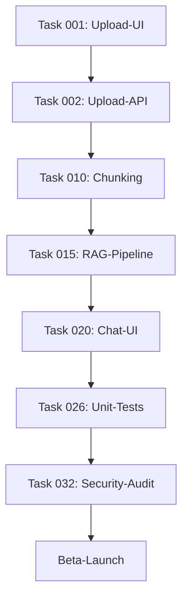

# AI Project Example - RAG Dokumenten-Analyse-System

Ein Beispiel-Projekt, das zeigt, wie man mit Claude Code Slash-Commands aus dem [talent-factory/dotfiles](https://github.com/talent-factory/dotfiles) Repository ein komplettes Software-Projekt von der Planung bis zur Implementierung aufbaut.

## Überblick

Dieses Projekt demonstriert den vollständigen Entwicklungs-Workflow für ein **RAG-basiertes Dokumenten-Analyse-System** mit folgenden Features:

- Web-GUI zum Hochladen von Dokumenten (PDF, Word)
- Vektorisierung und Speicherung der Dokumente
- Chat-Interface für Fragen und Antworten basierend auf den hochgeladenen Dokumenten

## Für Studierende

Dieses Repository dient als Lernbeispiel für strukturierte Software-Entwicklung mit KI-Unterstützung. Der Workflow zeigt, wie man von einer Idee zu einem vollständig geplanten und implementierten Projekt kommt.

---

## Workflow: Von der Idee zum Code

### Phase 1: PRD-Erstellung (Product Requirements Document)

**Ziel**: Aus einer Idee ein strukturiertes Anforderungsdokument erstellen

**Command**:
```bash
/project:create-prd "Wir wollen ein einfaches RAG System erstellen (Web-GUI), welches das Hochladen eines Dokumentes (pdf, Word) ermöglicht. Das Dokument soll in Vektoren abgelegt und für spätere Fragen/Antworten (Chat) zur Verfügung stehen." PRDs/01-rag-system.md
```

**Was passiert**:
1. Claude analysiert die Funktionsbeschreibung
2. Erstellt ein umfassendes PRD mit:
   - Executive Summary
   - Problemstellung mit Evidenz
   - Ziele & Erfolgsmetriken (SMART)
   - User Stories & Personas
   - Funktionale & Nicht-funktionale Anforderungen
   - Timeline & Meilensteine
   - Risikobewertung

**Resultat**:
- Datei: `PRDs/01-rag-system.md`
- Ein vollständiges PRD-Dokument, das als Basis für die Planung dient

**Nächster Schritt**:
Das PRD-Dokument **überprüfen und anpassen**:
- Sind alle Anforderungen korrekt?
- Fehlen wichtige Features?
- Sind die Ziele realistisch?

→ **Das PRD ist jetzt Ihre "Single Source of Truth"** für das Projekt

---

### Phase 2: Projektplanung (Filesystem-basiert)

**Ziel**: Aus dem PRD einen detaillierten Projekt-Plan mit einzelnen Tasks erstellen

**Command**:
```bash
/project:create-plan-fs PRDs/01-rag-system.md
```

**Was passiert**:
1. Claude liest das PRD-Dokument
2. Erstellt eine Filesystem-Struktur in `.plans/[feature-name]/`
3. Generiert:
   - `EPIC.md` - Feature-Übersicht mit Business Value
   - `STATUS.md` - Progress-Tracking mit Dependencies-Graph
   - `tasks/task-NNN-[slug].md` - Einzelne, umsetzbare Tasks

**Resultat**:
```
.plans/rag-dokumenten-analyse-system/
├── EPIC.md                          # Feature-Übersicht
├── STATUS.md                        # Projekt-Status & Progress
└── tasks/
    ├── task-001-upload-ui-komponente.md
    ├── task-002-upload-api-endpoint.md
    ├── task-010-chunking-strategie.md
    ├── task-015-rag-query-pipeline.md
    ├── task-020-chat-ui-komponente.md
    ├── task-026-unit-tests-backend.md
    ├── task-032-security-audit.md
    └── task-035-api-dokumentation.md
```

**Verzeichnis-Struktur verstehen**:

#### `EPIC.md` - Die Feature-Übersicht
Enthält:
- **Executive Summary**: Was wird gebaut und warum?
- **Business Value**: Welchen Nutzen bringt das Feature?
- **Success Metrics**: Wie messen wir den Erfolg?
- **Timeline**: Wann wird was fertig?
- **Dependencies**: Was brauchen wir extern?
- **Key Risks**: Welche Risiken gibt es?
- **MVP Scope**: Was ist Must-Have, Should-Have, Won't-Have?

→ **Für Studierende**: Dies ist Ihre "Projekt-Charta" - hier sehen Sie das große Ganze

#### `STATUS.md` - Der Projekt-Status
Enthält:
- **Progress Overview**: Wie viele Tasks sind erledigt?
- **Tasks by Priority**: Must-Have vs. Should-Have
- **Tasks by Status**: Completed, In Progress, Pending, Blocked
- **Story Points Summary**: Wie viel Aufwand ist geplant?
- **Dependencies Graph**: Welche Tasks hängen voneinander ab? (Mermaid-Diagramm)
- **Critical Path**: Was muss zuerst erledigt werden?
- **Next Steps**: Was sind die nächsten konkreten Schritte?

→ **Für Studierende**: Dies ist Ihr "Projekt-Dashboard" - hier tracken Sie den Fortschritt

**Beispiel Dependencies Graph** (aus STATUS.md):


→ **Critical Path**: Dieser Graph zeigt die Reihenfolge, in der Tasks umgesetzt werden müssen

#### `tasks/task-NNN-[slug].md` - Die einzelnen Tasks
Jede Task-Datei enthält:
- **Metadata**: ID, Status, Priority, Story Points, Labels, Assignee
- **Description**: Was soll gebaut werden? (inkl. User Story)
- **Acceptance Criteria**: Wann ist die Task fertig? (Checkliste)
- **Dependencies**: Welche anderen Tasks müssen vorher erledigt sein?
- **Agent Recommendation**: Welcher KI-Agent ist am besten geeignet?
- **Implementation Notes**: Technische Details, API-Integration, Datei-Struktur
- **Testing Strategy**: Wie wird getestet?
- **Notes**: PRD-Referenzen, Challenges, Future Enhancements

**Beispiel Task-Struktur** (task-001-upload-ui-komponente.md):
```markdown
# Task-001: Upload-UI-Komponente mit Drag-and-Drop

## Metadata
- **ID**: task-001
- **Status**: pending
- **Priority**: must
- **Estimate**: 3 Story Points
- **Labels**: frontend, react, ui, upload
- **Assignee**: frontend-developer

## Description
Erstelle eine React-Komponente für den Datei-Upload mit
Drag-and-Drop-Funktionalität.

**User Story**: Als Anna möchte ich ein PDF/Word-Dokument
hochladen, damit ich später Fragen dazu stellen kann.

## Acceptance Criteria
- [ ] Drag-and-Drop-Zone implementiert
- [ ] Format-Validierung (nur .pdf, .docx)
- [ ] Größen-Validierung (max 20MB)
- [ ] Upload-Progress-Bar
- [ ] Fehlerbehandlung
- [ ] Responsive Design
- [ ] Accessibility (WCAG 2.1 AA)

## Dependencies
- **Requires**: None (kann sofort starten)
- **Blocks**: task-005 (Dokumenten-Übersicht)

## Agent Recommendation
**Recommended Agent**: `frontend-developer`

**Rationale**: React-Komponenten-Entwicklung mit komplexem
State-Management, File-Handling und Accessibility-Requirements.

## Implementation Notes
### Technical Approach
- React Component mit Hooks (useState, useCallback)
- File-Drop-Event-Handling
- FormData für Multipart-Upload
- Axios/Fetch für Upload mit Progress-Tracking

### Files to Create/Modify
- `src/components/DocumentUpload/DocumentUpload.tsx`
- `src/components/DocumentUpload/DocumentUpload.test.tsx`
- `src/hooks/useFileUpload.ts`
...
```

→ **Für Studierende**: Jede Task ist ein "Mini-Projekt" mit klaren Anforderungen und Tests

---

### Phase 3: Task-Implementation

**Ziel**: Einen einzelnen Task aus dem Plan implementieren

**Command**:
```bash
/develop:implement-fs-task task-001
```

**Oder interaktiv (ohne Task-ID)**:
```bash
/develop:implement-fs-task
```
→ Claude zeigt alle verfügbaren Tasks und Sie wählen einen aus

**Was passiert**:
1. **Task auswählen**: Claude findet die Task-Datei in `.plans/*/tasks/`
2. **Dependency-Check**: Prüft ob alle Required-Tasks abgeschlossen sind
3. **Branch erstellen**: `task-001-upload-ui-komponente`
4. **Status aktualisieren**: Task-Status → `in_progress` in Task-Datei
5. **Implementierung**: Code-Änderungen basierend auf Task-Beschreibung
   - Analysiert Acceptance Criteria
   - Erstellt notwendige Dateien
   - Implementiert Tests
   - Folgt Agent-Empfehlung (z.B. frontend-developer)
6. **PR erstellen**: Pull Request mit Task-Details
7. **Finalisierung**:
   - Task-Status → `completed`
   - `STATUS.md` aktualisieren (Progress, Dependencies)

**Workflow-Diagramm**:
```
Task auswählen
    ↓
Dependencies erfüllt? ─(Nein)→ Warnung → Anderen Task wählen
    ↓ (Ja)
Branch erstellen (task-NNN-description)
    ↓
Task-Status: pending → in_progress
    ↓
Code implementieren
    ├─ Acceptance Criteria durchgehen
    ├─ Dateien erstellen/ändern
    ├─ Tests schreiben
    └─ Agent-Empfehlung nutzen
    ↓
Pull Request erstellen
    ├─ Task-Details in PR-Body
    ├─ Acceptance Criteria als Checklist
    └─ Labels basierend auf Task-Labels
    ↓
Task finalisieren
    ├─ Task-Status: in_progress → completed
    ├─ STATUS.md aktualisieren
    └─ Dependencies-Graph aktualisieren
    ↓
Fertig! ✅
```

**Resultat**:
- Git-Branch: `task-001-upload-ui-komponente`
- Implementierter Code (z.B. React-Komponente)
- Tests
- Pull Request
- Aktualisierte Task-Datei (Status: `completed`)
- Aktualisierte `STATUS.md`

---

## Kompletter Workflow im Überblick

```
1. Idee/Anforderung
        ↓
   /project:create-prd
        ↓
   PRDs/01-rag-system.md (REVIEW & ADJUST)
        ↓
   /project:create-plan-fs
        ↓
   .plans/[feature]/
   ├── EPIC.md (Übersicht)
   ├── STATUS.md (Progress)
   └── tasks/task-NNN-*.md (Tasks)
        ↓
   /develop:implement-fs-task task-001
        ↓
   Branch + Code + Tests + PR
        ↓
   Code Review → Merge
        ↓
   /develop:implement-fs-task task-002
        ↓
   ... (Weitere Tasks)
        ↓
   Alle Tasks completed → Feature Launch! 🚀
```

---

## Setup & Installation

### Voraussetzungen

1. **Claude Code** installiert
2. **Slash-Commands** aus [talent-factory/dotfiles](https://github.com/talent-factory/dotfiles)
3. **Git** installiert

### Commands installieren

```bash
# Clone das dotfiles Repository
git clone https://github.com/talent-factory/dotfiles.git

# Kopiere die Commands in dein Projekt
cp -r dotfiles/.claude .
cp -r dotfiles/.augment .
cp -r dotfiles/.windsurf .
cp -r dotfiles/.github/prompts .github/
```

### Verfügbare Commands

#### Projekt-Management
- `/project:create-prd` - Product Requirements Document erstellen
- `/project:create-plan` - Linear-basierte Planung (mit Linear API)
- `/project:create-plan-fs` - Filesystem-basierte Planung (lokale Dateien)

#### Development
- `/develop:implement-fs-task` - Task aus Filesystem-Plan implementieren
- `/develop:implement-linear-task` - Task aus Linear implementieren
- `/develop:commit` - Professionelle Git-Commits mit Checks
- `/develop:create-pr` - Pull Request erstellen mit Task-Integration

#### Validierung
- `/develop:check-agents` - Agent-Dateien validieren
- `/develop:check-commands` - Command-Dateien validieren
- `/develop:ruff-check` - Python Code linting

#### Skills
- `/skills:build-skill` - Neue Claude Code Skills entwickeln
- `/skills:package-skill` - Skills verpacken für Distribution

---

## Verzeichnisstruktur

```
ai-project-example/
├── .claude/
│   ├── agents/              # KI-Agenten (code-reviewer, frontend-developer, etc.)
│   └── commands/            # Slash-Commands
│       ├── project/         # PRD, Planning
│       ├── develop/         # Implementation, Commits, PRs
│       └── skills/          # Skill-Entwicklung
├── .plans/                  # Filesystem-basierte Projekt-Pläne
│   └── [feature-name]/
│       ├── EPIC.md          # Feature-Übersicht
│       ├── STATUS.md        # Projekt-Status
│       └── tasks/
│           └── task-NNN-*.md # Einzelne Tasks
├── PRDs/                    # Product Requirements Documents
│   └── 01-rag-system.md
├── .gitignore
├── LICENSE                  # MIT License
├── README.md               # Diese Datei
└── CONTRIBUTING.md         # Contribution Guidelines
```

---

## Beispiel: RAG-System entwickeln

### Schritt 1: PRD erstellen

```bash
/project:create-prd "RAG-System mit PDF/Word Upload und Chat" PRDs/01-rag-system.md
```

**Review das PRD** in `PRDs/01-rag-system.md` und passe es an:
- Sind die User Stories korrekt?
- Fehlen wichtige Anforderungen?
- Sind die Erfolgsmetriken realistisch?

### Schritt 2: Plan erstellen

```bash
/project:create-plan-fs PRDs/01-rag-system.md
```

**Review den Plan** in `.plans/rag-dokumenten-analyse-system/`:
- Öffne `EPIC.md` → Verstehe das Feature
- Öffne `STATUS.md` → Siehe alle Tasks & Dependencies
- Öffne `tasks/` → Schaue dir die einzelnen Tasks an

### Schritt 3: Tasks implementieren

**Task 1: Upload-UI**
```bash
/develop:implement-fs-task task-001
```

**Task 2: Upload-API** (erst nachdem Task 1 completed ist)
```bash
/develop:implement-fs-task task-002
```

**... und so weiter bis alle Tasks completed sind**

### Schritt 4: Review & Merge

Nach jedem Task:
1. Pull Request reviewen
2. Tests ausführen
3. Code-Review
4. Merge in main branch

---

## Best Practices für Studierende

### 1. PRD ist die Single Source of Truth
- Alle Anforderungen müssen im PRD dokumentiert sein
- Änderungen am PRD bedeuten: Plan neu generieren
- PRD sollte von Stakeholdern reviewed werden

### 2. Tasks sind atomar
- Jede Task sollte in 2-8 Story Points umsetzbar sein
- Zu große Tasks? → Aufteilen!
- Tasks sollten unabhängig testbar sein

### 3. Dependencies beachten
- Schaue dir `STATUS.md` → Dependencies Graph an
- Implementiere Tasks in der richtigen Reihenfolge
- Blockierte Tasks? → Dependencies zuerst erledigen

### 4. Acceptance Criteria sind Pflicht
- Jede Task hat Acceptance Criteria
- Alle Checkboxen müssen ✅ sein vor dem Merge
- Tests basieren auf Acceptance Criteria

### 5. Agent-Empfehlungen nutzen
- Jede Task hat einen empfohlenen Agent
- `frontend-developer` für React/Next.js
- `python-expert` für Backend
- `ai-engineer` für LLM/RAG-Features
- `code-reviewer` für Quality Checks

### 6. STATUS.md up-to-date halten
- Nach jedem completed Task aktualisieren
- Progress tracken
- Blockers dokumentieren

---

## Agents (KI-Experten)

Dieses Projekt nutzt spezialisierte KI-Agenten für verschiedene Aufgaben:

- **code-reviewer** - Code-Qualität & Sicherheit (OWASP, Best Practices)
- **frontend-developer** - React/Next.js, UI-Komponenten, Tailwind CSS
- **java-developer** - Spring Boot, Enterprise Java (auch für Python-Backend nutzbar)
- **python-expert** - Python Best Practices, FastAPI, Django
- **ai-engineer** - LLM-Integration, RAG-Systeme, ML-Pipelines
- **agent-expert** - Agent-Entwicklung & Prompt Engineering
- **markdown-syntax-formatter** - Dokumentation & Markdown

→ Agents werden automatisch basierend auf Task-Typ vorgeschlagen

---

## Lizenz

MIT License - siehe [LICENSE](LICENSE) Datei

---

## Contributing

Siehe [CONTRIBUTING.md](CONTRIBUTING.md) für Contribution Guidelines

---

## Ressourcen

- **Slash-Commands**: [talent-factory/dotfiles](https://github.com/talent-factory/dotfiles)
- **Claude Code**: [Anthropic Claude](https://www.anthropic.com/)
- **PRD Best Practices**: Siehe `.claude/commands/project/create-prd/best-practices.md`
- **Task Breakdown Strategien**: Siehe `.claude/commands/project/create-plan/task-breakdown.md`

---

## Fragen?

Dieses Projekt ist ein Lernbeispiel. Bei Fragen:
1. Schaue in die Command-Dokumentation (`.claude/commands/`)
2. Lies die Detail-Dateien in den Command-Unterordnern
3. Öffne ein Issue in diesem Repository

**Viel Erfolg beim Lernen! 🚀**
